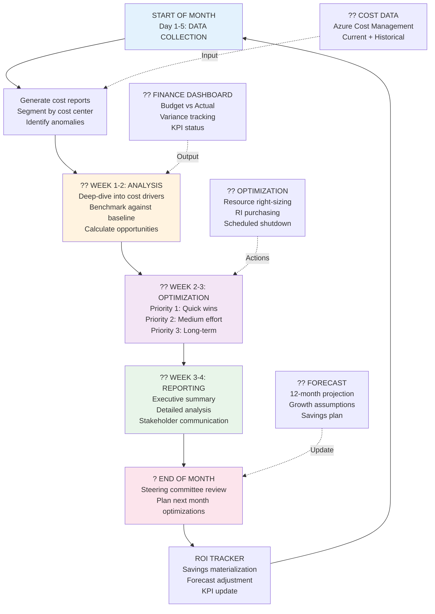
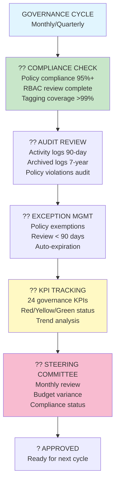
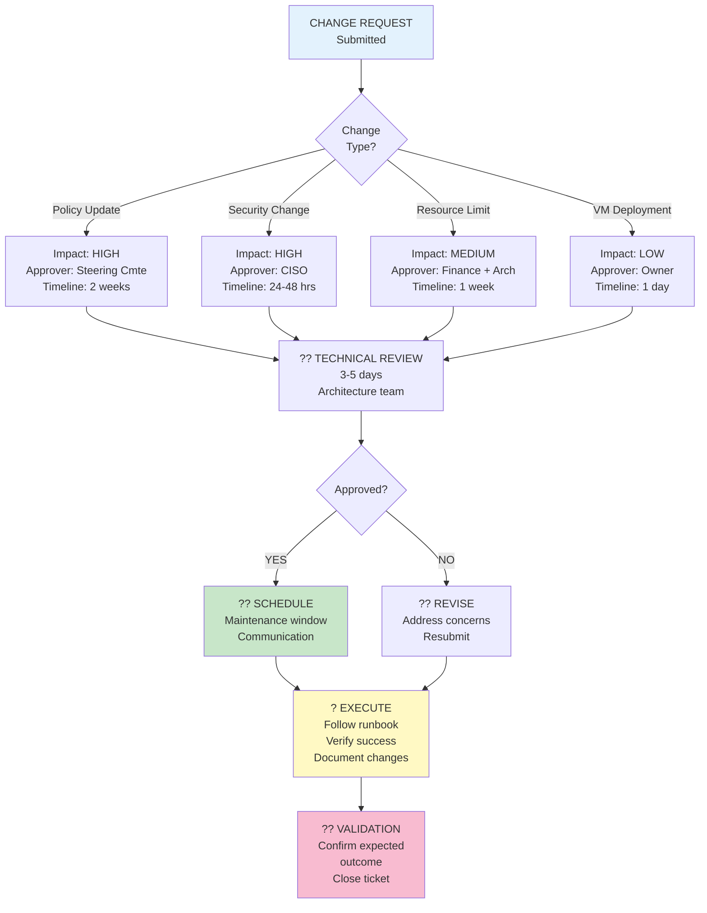

# Enterprise Azure Landing Zone & Security Architecture

## Executive Summary
This document presents a high-level Azure enterprise landing zone design aligned with governance, security, connectivity, and operational controls. The architecture uses management groups and subscription boundaries to separate core platform services, security operations, shared services, and application workloads.

Key goals:
- Establish a secure hub-and-spoke foundation for enterprise workloads.
- Apply consistent governance using Azure Policy and management groups.
- Centralize identity, monitoring, and threat protection.
- Align architecture with Zero Trust security principles.

## Visual Architecture

```mermaid
flowchart TB
    subgraph MG[Management Groups]
        mg1[Root Management Group]
        mg2[Landing Zone Management Group]
        mg3[Security Management Group]
    end

    subgraph SUBS[Subscriptions]
        sub1[Connectivity Subscription]
        sub2[Shared Services Subscription]
        sub3[Platform Subscription]
        sub4[Application Subscription]
        sub5[Security Subscription]
    end

    mg1 --> mg2
    mg1 --> mg3
    mg2 --> sub1
    mg2 --> sub2
    mg2 --> sub3
    mg2 --> sub4
    mg3 --> sub5

    sub1 --> hub[Hub VNet]
    sub1 --> afw[Azure Firewall]
    sub1 --> bastion[Azure Bastion]
    sub1 --> pdns[Private DNS]
    sub2 --> ss[Shared Services]
    sub3 --> aks[AKS Cluster]
    sub4 --> app[Application Spokes]
    sub5 --> sentinel[Microsoft Sentinel]

    hub --> afw
    hub --> bastion
    hub --> pdns
    pdns --> ss
    pdns --> aks
    pdns --> app
    ss --> aks
    ss --> app

    sub1 -.->|Azure Policy| hub
    sub1 -.->|Azure Policy| afw
    sub2 -.->|Azure Policy| ss
    sub3 -.->|Azure Policy| aks
    sub4 -.->|Azure Policy| app
    sub5 -.->|Azure Policy| sentinel

    monitor[Monitoring
(Log Analytics,
Azure Monitor,
Metrics)]
    defender[Microsoft Defender for Cloud]
    policy[Azure Policy]
    ca[Conditional Access]
    pim[Privileged Identity Management]
    kv[Azure Key Vault]
    zt[Zero Trust]

    sub5 --> defender
    sub5 --> sentinel
    mg3 --> policy
    mg3 --> ca
    mg3 --> pim
    mg3 --> kv
    mg3 --> zt
    monitor --> hub
    monitor --> aks
    monitor --> app

    style MG fill:#f8f9fa,stroke:#2d4a8c,stroke-width:2px
    style SUBS fill:#eef6fb,stroke:#2d4a8c,stroke-width:2px
    style hub fill:#d1e7dd,stroke:#1f7a5d,stroke-width:2px
    style afw fill:#fceddd,stroke:#b35900,stroke-width:2px
    style bastion fill:#dbeafe,stroke:#1d4ed8,stroke-width:2px
    style pdns fill:#f3f4f6,stroke:#6b7280,stroke-width:2px
    style ss fill:#f8d7da,stroke:#9c2a2a,stroke-width:2px
    style aks fill:#f0fdf4,stroke:#166534,stroke-width:2px
    style app fill:#fff7ed,stroke:#c2410c,stroke-width:2px
    style sentinel fill:#ebe5ff,stroke:#6d28d9,stroke-width:2px
    style defender fill:#e2e8f0,stroke:#0f766e,stroke-width:2px
    style policy fill:#eef2ff,stroke:#4338ca,stroke-width:2px
    style ca fill:#fff1f2,stroke:#be123c,stroke-width:2px
    style pim fill:#f0f9ff,stroke:#0c4a6e,stroke-width:2px
    style kv fill:#fef3c7,stroke:#b45309,stroke-width:2px
    style zt fill:#ecfdf5,stroke:#065f46,stroke-width:2px
    style monitor fill:#f1f5f9,stroke:#0f172a,stroke-width:2px
```

## Architecture Overview

### Governance and management
- **Management Groups** provide the hierarchical foundation for policy enforcement and subscription segmentation.
- **Azure Policy** delivers guardrails for compliance, resource consistency, and security controls across the enterprise.
- **Subscription design** separates connectivity, shared services, platform, applications, and security operations.

### Network and connectivity
- **Hub VNet** is the central transit network for secure traffic inspection and service integration.
- **Azure Firewall** enforces centralized network controls and inspection for inbound/outbound traffic.
- **Azure Bastion** enables secure administrative access without exposing management endpoints publicly.
- **Private DNS** provides private name resolution for hub-and-spoke workloads.
- **Azure vWAN** (optional) provides simplified multi-region connectivity and advanced traffic management.

### Shared services and platform
- **Shared Services** host identity, DNS, backup, and operational management capabilities.
- **AKS** is deployed in a dedicated platform subscription, with private connectivity and integration to shared services.
- **Application Spokes** isolate customer-facing and business workloads while reusing centralized security and connectivity services.

### Security and monitoring
- **Microsoft Defender for Cloud** provides posture management, threat protection, and secure score insights.
- **Microsoft Sentinel** centralizes security analytics, detection, and incident response.
- **Azure Key Vault** secures secrets, certificates, and cryptographic keys with managed identities and private network access.
- **Zero Trust** drives verification of every connection, least privilege access, and continuous monitoring.
- **Conditional Access** and **PIM** ensure identity-based controls and just-in-time privileged access.

## Architecture Components

- **Management Groups**: Organize subscriptions and enforce governance at scale.
- **Connectivity Subscription**: Hosts hub network services and centralized security controls.
- **Shared Services Subscription**: Runs common platform services and identity infrastructure.
- **Platform Subscription**: Supports AKS and platform-level compute resources.
- **Application Subscription**: Contains isolated application spokes for workload segregation.
- **Security Subscription**: Operates Sentinel, Defender, and centralized security tooling.
- **Hub VNet**: Central transit and connectivity fabric for secure cross-subscription traffic.
- **Azure Firewall**: Network enforcement point for traffic filtering and inspection.
- **Azure Bastion**: Secure remote administration without public IP exposure.
- **Private DNS**: Private zone resolution for hybrid and spoke services.
- **Shared Services**: Common platform services that support workloads across the landing zone.
- **AKS**: Enterprise container platform with private network integration.
- **Application Spokes**: Segregated workload environments that consume shared security and connectivity services.
- **Monitoring**: Log Analytics and Azure Monitor for visibility and operational telemetry.
- **Azure Policy**: Policy-driven controls to enforce compliance and standardization.
- **Microsoft Defender for Cloud**: Cloud security posture and threat detection.
- **Conditional Access**: Adaptive identity protection for Azure resources.
- **Privileged Identity Management**: Just-in-time privileged access for administrators.
- **Azure Key Vault**: Central secrets and key management.
- **Microsoft Sentinel**: Security analytics and investigation platform.
- **Zero Trust**: Security model that assumes breach and verifies every request.

## Best Practices

### 1. Embed governance at scale
- Enforce Azure Policy at management group scope rather than subscription-only scope.
- Apply initiative definitions for landing zone consistency, security posture, and compliance.
- Use resource tagging and naming standards to improve visibility and cost governance.

### 2. Build a secure hub-and-spoke foundation
- Centralize Azure Firewall, Bastion, and DNS in the connectivity subscription.
- Keep application workloads in spokes with only the minimal required network access.
- Use private endpoints and service chaining to reduce public exposure.

### 3. Strengthen identity and access
- Require MFA and Conditional Access for all privileged and administrative users.
- Use Azure AD Privileged Identity Management for JIT access to critical roles.
- Enforce least privilege and periodic access reviews.

### 4. Protect workloads with integrated security
- Enable Microsoft Defender for Cloud for AKS, VMs, storage, networking, and PaaS services.
- Monitor posture recommendations and remediate high-risk findings promptly.
- Feed Defender alerts into Sentinel for end-to-end incident response.

### 5. Secure secrets and keys centrally
- Store application secrets, certificates, and keys in Azure Key Vault.
- Use Managed Identity access and private endpoint connectivity.
- Restrict vault access with network rules and RBAC.

### 6. Centralize monitoring and response
- Stream logs and metrics to Log Analytics workspaces.
- Use Azure Monitor alerts and dashboards to track operational health.
- Consolidate security telemetry in Microsoft Sentinel for detection and investigation.

### 7. Adopt a Zero Trust operating model
- Verify every connection, enforce least privilege, and assume breach.
- Combine identity controls, device compliance, and network segmentation.
- Continuously validate security posture and adapt controls over time.

### 8. Maintain an evolving security architecture
- Review policies, guardrails, and security controls regularly.
- Update the landing zone as new Azure services and best practices emerge.
- Keep architecture documentation and operational runbooks current.

---

## Network Architecture: Hub-Spoke vs. Azure vWAN

### Option 1: Hub-and-Spoke Architecture (Traditional)

**Best For:** Single-region deployments, traditional enterprises, simpler topologies

#### Hub-Spoke Detailed Architecture

```
                        ON-PREMISES
                              |
                    [ExpressRoute + VPN]
                              |
                    ┌─────────┴──────────┐
                    ↓                    ↓
          ┌─────────────────────────────────────┐
          │      CONNECTIVITY SUBSCRIPTION      │
          ├─────────────────────────────────────┤
          │                                     │
          │     HUB VNET (10.0.0.0/16)          │
          │  ┌──────────────────────────────┐   │
          │  │ Gateway Subnet (10.0.1.0/24) │   │
          │  │ [ExpressRoute Gateway]       │   │
          │  │ [VPN Gateway - Backup]       │   │
          │  └──────────────────────────────┘   │
          │                                     │
          │  ┌──────────────────────────────┐   │
          │  │ Firewall Subnet (10.0.2.0/24)│   │
          │  │ [Azure Firewall]             │   │
          │  │ [Threat Detection]           │   │
          │  │ [Policy Engine]              │   │
          │  └──────────────────────────────┘   │
          │                                     │
          │  ┌──────────────────────────────┐   │\n          │  │ Bastion Subnet (10.0.3.0/24) │   │\n          │  │ [Azure Bastion]              │   │\n          │  │ [Admin Access Point]         │   │\n          │  └──────────────────────────────┘   │\n          │                                     │\n          │  ┌──────────────────────────────┐   │\n          │  │ DNS Subnet (10.0.4.0/24)     │   │\n          │  │ [Private DNS Resolver]       │   │\n          │  │ [Conditional Forwarding]     │   │\n          │  └──────────────────────────────┘   │\n          │                                     │\n          └─────────────┬──────────────────────┘\n                        │\n         ┌──────────────┼──────────────┬──────────────┐\n         ↓              ↓              ↓              ↓\n   ┌──────────────┐┌──────────────┬──────────────┬──────────────┐\n   │  PROD SPOKE  ││ STAGING SPOKE│ DEV SPOKE    │ SHARED SRVCS │\n   ├──────────────┤├──────────────┼──────────────┼──────────────┤\n   │ 10.1.0.0/20  ││ 10.2.0.0/20  │ 10.3.0.0/20  │ 10.4.0.0/20  │\n   │              ││              │              │              │\n   │ Web Tier     ││ Web/Test     │ Dev/Build    │ Identity     │\n   │ App Tier     ││ App/Test     │ Debug        │ DNS          │\n   │ Data Tier    ││ Data/Test    │ Logs         │ Backup       │\n   │              ││              │              │ Monitoring   │\n   │ UDR: →FW     ││ UDR: →FW     │ UDR: →FW     │ UDR: →FW     │\n   └──────────────┘└──────────────┴──────────────┴──────────────┘\n         ↑                     ↑                     ↑\n         └─────────────────────┴─────────────────────┘\n              All traffic flows through Hub Firewall\n```\n\n**Hub-Spoke Traffic Flow:**\n```\nSpoke A → UDR [0.0.0.0/0 → Firewall IP]\n         → Firewall Rules (Allow/Deny)\n         → Route via Firewall NIC\n         → VNet Peering to other Spoke\n         → Spoke B resources\n         \nSpoke to On-Premises:\nSpoke A → UDR [On-Prem Subnets → Firewall]\n        → Firewall\n        → Hub Gateway (ExpressRoute/VPN)\n        → On-Premises Network\n```\n\n**Hub-Spoke Characteristics:**\n\n| Aspect | Hub-Spoke |\n|---|---|\n| **Connectivity** | All spokes peer to hub; hub is traffic transit point |\n| **Latency** | Single hop to firewall; predictable |\n| **Scalability** | Scales to 50-100 spokes per hub |\n| **Regions** | Single region (multi-region requires multiple hubs) |\n| **Firewall** | Centralized, all traffic inspected |\n| **Cost** | Lower (traditional VNet peering) |\n| **Complexity** | Medium (routing via UDRs) |\n| **On-Prem** | ExpressRoute + VPN gateways in hub |\n\n**Advantages:**\n- ✅ Predictable routing and latency\n- ✅ Full control over traffic via firewall\n- ✅ Proven, stable architecture\n- ✅ Lower operational cost\n- ✅ Easy to audit and troubleshoot\n\n**Limitations:**\n- ❌ Hub becomes single point of failure\n- ❌ Hub firewall can become bottleneck at scale\n- ❌ Multi-region requires manual hub replication\n- ❌ Spoke-to-spoke communication always backhops through hub\n- ❌ Limited to 50-100 spokes per region\n\n---\n\n### Option 2: Azure Virtual WAN (vWAN) Architecture (Recommended for Enterprise)\n\n**Best For:** Multi-region deployments, enterprise scale (1000+ sites), simplified operations, advanced connectivity\n\n#### Azure vWAN High-Level Architecture\n\n```\nGLOBAL ENTERPRISE NETWORK WITH AZURE VWAN\n\n                        ON-PREMISES SITES\n                    (Datacenter, Branch Offices)\n                              │\n                   ┌──────────┼──────────┐\n                   ↓          ↓          ↓\n              Site A      Site B      Site C\n           (DC-HQ)    (Regional)   (Remote)\n              │           │           │\n         [ExpressRoute] [S2S VPN] [P2S VPN]\n                   └──────────┬──────────┘\n                              ↓\n                   ┌────────────────────────┐\n                   │   AZURE VIRTUAL WAN     │\n                   ├────────────────────────┤\n                   │   vWAN Hub (East US)   │\n                   │  ┌────────────────────┐│\n                   │  │ Hub VNet           ││\n                   │  │ 10.0.0.0/16        ││\n                   │  │ [Firewall]         ││\n                   │  │ [Routing]          ││\n                   │  │ [NVA options]      ││\n                   │  └────────────────────┘│\n                   └────────────────────────┘\n                              │\n                    ┌─────────┼─────────┐\n                    ↓         ↓         ↓\n        ┌──────────────────────────────────────┐\n        │   vWAN Hub (West US) + more regions  │\n        │   (Auto-mesh connectivity)           │\n        └──────────────────────────────────────┘\n                              │\n         ┌────────────────────┼────────────────────┐\n         ↓                    ↓                    ↓\n    ┌──────────────┐   ┌──────────────┐   ┌──────────────┐\n    │PROD VNet     │   │STAGING VNet  │   │DEV VNet      │\n    │10.1.0.0/16  │   │10.2.0.0/16   │   │10.3.0.0/16   │\n    │              │   │              │   │              │\n    │ Connected to │   │ Connected to │   │ Connected to │\n    │ vWAN Hub     │   │ vWAN Hub     │   │ vWAN Hub     │\n    │              │   │              │   │              │\n    │ Auto-learned │   │ Auto-learned │   │ Auto-learned │\n    │ routes       │   │ routes       │   │ routes       │\n    └──────────────┘   └──────────────┘   └──────────────┘\n\n    ✓ Any-to-any connectivity\n    ✓ Automatic mesh routing\n    ✓ Multi-region optimization\n```\n\n#### Azure vWAN Detailed Hub Architecture\n\n```\nVWAN HUB INTERNAL STRUCTURE (East US)\n\n┌─────────────────────────────────────────────────────────┐\n│                  VWAN HUB (10.0.0.0/16)                 │\n├─────────────────────────────────────────────────────────┤\n│                                                         │\n│  ┌─────────────────────────────────────────────────┐   │\n│  │ ExpressRoute Gateway                            │   │\n│  │ [On-premises connectivity @ 100Mbps-100Gbps]    │   │\n│  │ [BGP routing automation]                        │   │\n│  │ [Multi-circuit HA]                              │   │\n│  └─────────────────────────────────────────────────┘   │\n│                                                         │\n│  ┌─────────────────────────────────────────────────┐   │\n│  │ VPN Gateway (S2S + P2S)                         │   │\n│  │ [Site-to-Site VPN for branch offices]           │   │\n│  │ [Point-to-Site VPN for remote users]            │   │\n│  │ [IKEv2/OpenVPN support]                         │   │\n│  │ [Scale: 20+ site-to-site tunnels]               │   │\n│  └─────────────────────────────────────────────────┘   │\n│                                                         │\n│  ┌─────────────────────────────────────────────────┐   │\n│  │ Hub Subnet (Firewall + Routing)                 │   │\n│  │ [Azure Firewall Premium (optional)]             │   │\n│  │ [Third-party NVA support]                       │   │\n│  │ [Advanced traffic filtering]                    │   │\n│  └─────────────────────────────────────────────────┘   │\n│                                                         │\n│  ┌─────────────────────────────────────────────────┐   │\n│  │ Route Tables (Automatic)                        │   │\n│  │ [0.0.0.0/0 → Firewall]                          │   │\n│  │ [On-prem routes auto-learned via BGP]           │   │\n│  │ [Custom route policies]                         │   │\n│  └─────────────────────────────────────────────────┘   │\n│                                                         │\n│  ┌─────────────────────────────────────────────────┐   │\n│  │ Routing Engine                                  │   │\n│  │ [Spoke VNet connections]                        │   │\n│  │ [On-premises connections]                       │   │\n│  │ [BGP prefix handling]                           │   │\n│  │ [Policy-based routing (optional)]               │   │\n│  └─────────────────────────────────────────────────┘   │\n│                                                         │\n└─────────────────────────────────────────────────────────┘\n        │                    │                    │\n        ↓                    ↓                    ↓\n   [ExpressRoute]    [S2S VPN]        [Internal Routing]\n        │                    │                    │\n   On-Premises          Branch Sites         VNet Spokes\n```\n\n**vWAN Traffic Flow:**\n```\nSpoke A (10.1.0.0/16) → Hub\n  ├─ Route learning: 10.1.0.0/16 advertised to hub\n  ├─ Hub advertises all known routes back to Spoke A\n  └─ Result: Spoke A learns 10.2.0.0/16 (Spoke B), On-prem routes\n\nSpoke A ↔ Spoke B Communication:\nSpoke A (10.1.1.1) → Spoke B (10.2.1.1)\n  ├─ Traffic flows directly via vWAN hub (optimized)\n  ├─ No backhaul through firewall (unless policy enforced)\n  ├─ BGP has learned 10.2.0.0/16 via hub\n  └─ Direct inter-spoke connectivity established\n\nSpoke ↔ On-Premises:\nSpoke A → On-Premises (192.168.0.0/16)\n  ├─ Traffic flows through ExpressRoute gateway\n  ├─ Hub BGP advertises on-prem routes to spokes\n  ├─ Automatic failover to VPN if ExpressRoute down\n  └─ Firewall policy applied if enabled\n```\n\n**Azure vWAN Characteristics:**\n\n| Aspect | Azure vWAN |\n|---|---|\n| **Connectivity** | Full mesh; hub automatically connects all spokes + on-prem |\n| **Latency** | Optimized; hub-to-hub via Microsoft backbone |\n| **Scalability** | Scales to 1000+ branch sites per hub |\n| **Regions** | Multi-region with automatic mesh (hub-to-hub routing) |\n| **Firewall** | Optional (Firewall Premium), can exempt from inspection |\n| **Cost** | Higher (vWAN hub + bandwidth); pays for scale |\n| **Complexity** | Low (automatic routing, minimal config) |\n| **On-Prem** | ExpressRoute + VPN integrated in hub |\n\n**Advantages:**\n- ✅ Fully automated, any-to-any connectivity\n- ✅ Multi-region with simplified hub-to-hub routing\n- ✅ Built-in redundancy and failover\n- ✅ BGP-based dynamic routing (no manual UDRs)\n- ✅ Scales to 1000+ sites easily\n- ✅ Simplified operations (Microsoft manages hub)\n- ✅ Advanced routing policies available\n- ✅ Integrated threat protection options\n\n**Limitations:**\n- ❌ Higher cost (hub charges + transit charges)\n- ❌ Less granular traffic control vs. custom firewall\n- ❌ Longer to diagnose routing issues (abstracted)\n- ❌ Some customers still prefer explicit hub-spoke model\n\n---\n\n### Hub-Spoke vs. vWAN: Decision Matrix\n\n```\nSCENARIO                          RECOMMENDATION\n\n┌──────────────────────────────────────────────────────────────┐\n│ Single Region                                                │\n│ < 50 VNets/Spokes           ──→  HUB-SPOKE                  │\n│ Traditional setup                 (Lower cost)               │\n└──────────────────────────────────────────────────────────────┘\n\n┌──────────────────────────────────────────────────────────────┐\n│ Multi-Region                                                 │\n│ 100+ branch sites            ──→  AZURE VWAN                 │\n│ Simplified operations             (Automated mesh)           │\n└──────────────────────────────────────────────────────────────┘\n\n┌──────────────────────────────────────────────────────────────┐\n│ Hybrid Enterprise                                            │\n│ (On-prem + cloud)            ──→  AZURE VWAN                 │\n│ Multiple remote offices           (Any-to-any routing)       │\n└──────────────────────────────────────────────────────────────┘\n\n┌──────────────────────────────────────────────────────────────┐\n│ Cost-sensitive startup           ──→  HUB-SPOKE              │\n│ 10-20 VNets                       (Low operational cost)      │\n└──────────────────────────────────────────────────────────────┘\n\n┌──────────────────────────────────────────────────────────────┐\n│ Hyper-scale (1000+ sites)        ──→  AZURE VWAN             │\n│ Global enterprise               (Only scalable option)       │\n└──────────────────────────────────────────────────────────────┘\n```\n\n### Hybrid Approach: Hub-Spoke with vWAN Integration\n\nFor enterprises transitioning from hub-spoke to vWAN:\n\n```\nPhase 1: Existing Hub-Spoke         Phase 2: vWAN Onboarding\nRegion A: Hub + 5 Spokes     ──→   Region A: Migrate to vWAN Hub\n                                   + Connect via vWAN\n                                   \nPhase 3: Multi-Region vWAN\nEast US: vWAN Hub ←──→ West US: vWAN Hub\n    ↓                              ↓\n  Spokes                         Spokes\n  On-prem                        On-prem\n  Branches                       Branches\n\nBenefits:\n✓ Gradual migration (no cutover)\n✓ Keep existing investments\n✓ Add vWAN capabilities region-by-region\n✓ Eventually deprecate hub-spoke\n```

---

## Azure Well-Architected Framework (WAF) Alignment

This architecture is designed to meet all five pillars of the Azure Well-Architected Framework:

### 1. Reliability
**Objective:** Ensure systems remain available and recover from failures.

| Control | Implementation |
|---|---|
| **High Availability** | AKS with multiple node pools, zone-redundant databases, traffic distribution |
| **Backup & Recovery** | Azure Backup for VMs, database backup with geo-replication, automated recovery |
| **Health Monitoring** | Azure Monitor, Application Insights, proactive alerting |
| **Failover & DR** | Azure Site Recovery, geo-redundant storage, multi-region capabilities |
| **Circuit Breaking** | Application Gateway with backend health probes, Azure Load Balancer |
| **RTO/RPO Targets** | Critical systems: RTO 4 hours, RPO 1 hour; Important: RTO 8 hours, RPO 4 hours |

**Example:** A three-tier web application deployed across availability zones with automated backups and Azure Site Recovery enabled can achieve 99.99% uptime.

### 2. Security
**Objective:** Protect data, systems, and assets from unauthorized access.

| Control | Implementation |
|---|---|
| **Identity & Access** | Azure AD, Conditional Access, MFA, PIM for privileged access |
| **Network Security** | Azure Firewall, NSGs, private endpoints, DDoS protection, SASE |
| **Data Protection** | TLS/encryption in transit, encryption at rest, Azure Key Vault management |
| **Threat Detection** | Defender for Cloud, Microsoft Sentinel, anomaly detection |
| **Compliance** | Azure Policy enforcement, audit logging, regulatory compliance alignment |
| **Incident Response** | Automated playbooks, threat intelligence integration, 24/7 SOC monitoring |

**Example:** Conditional Access policies enforce MFA for all cloud access, while private endpoints eliminate public exposure of data services.

### 3. Cost Optimization
**Objective:** Minimize spending while maximizing value.

| Control | Implementation |
|---|---|
| **Right-Sizing** | VM SKU optimization, container consolidation, database tier adjustment |
| **Reserved Instances** | 60% of compute on 3-year RIs for predictable workloads |
| **Spot Instances** | Non-production workloads on 70-90% discounted spot pricing |
| **Auto-Scaling** | Dynamic scale based on demand, scheduled shutdown for non-production |
| **Cost Governance** | Monthly cost reviews, budget alerts, chargeback by cost center |
| **Optimization Target** | 30-40% cost savings through cloud economics vs. on-premises |

**Example:** Right-sizing a production VM from 8 vCPU to 4 vCPU combined with 3-year RIs can reduce monthly compute costs from $1,000 to $250.

### 4. Operational Excellence
**Objective:** Run and monitor systems to deliver business value.

| Control | Implementation |
|---|---|
| **Infrastructure as Code** | Bicep/Terraform for repeatable deployments, version-controlled |
| **Automation** | Runbooks for common tasks, automated patching, self-healing |
| **Monitoring & Logging** | Centralized Log Analytics, Azure Monitor dashboards, real-time alerts |
| **Documentation** | Comprehensive runbooks, architecture documentation, training programs |
| **Incident Management** | Defined escalation paths, on-call rotations, post-incident reviews |
| **Continuous Improvement** | Regular reviews, feedback loops, security and operational assessments |

**Example:** A deployment automation runbook can provision a complete landing zone in 2-3 hours with zero manual configuration.

### 5. Performance Efficiency
**Objective:** Use computing resources efficiently to meet requirements.

| Control | Implementation |
|---|---|
| **Load Balancing** | Application Gateway, Traffic Manager for geo-distribution |
| **Caching** | Azure Cache for Redis, CDN for content delivery, HTTP caching |
| **Database Optimization** | Query optimization, index tuning, connection pooling |
| **Concurrency** | AKS auto-scaling, serverless functions for spike handling |
| **Monitoring** | Application Performance Monitoring (APM), latency tracking |
| **Performance Target** | < 2 second page load time, 99.9% availability |

**Example:** Enabling Azure CDN for static assets reduces bandwidth costs by 80% and improves page load time by 60%.

---

## FinOps (Financial Operations) Framework

Comprehensive cost governance, optimization, and financial management for cloud operations.

### FinOps Principles & Lifecycle

```
┌─────────────────────────────────────────────────────────────────┐
│                    FinOps Maturity Cycle                         │
├─────────────────────────────────────────────────────────────────┤
│                                                                 │
│  INFORM                 OPTIMIZE              OPERATE            │
│  (Visibility)          (Efficiency)          (Management)       │
│     ↓                      ↓                      ↓              │
│  • Cost dashboards    • Right-sizing       • Automation        │
│  • Real-time alerts   • RIs & Spot VMs     • Chargeback        │
│  • Unit economics     • Scheduling         • Governance        │
│  • Org alignment      • Consolidation      • Monthly reviews    │
│                           ↑                                      │
│                      ITERATE (Continuous Improvement)          │
│                      • Feedback loops                           │
│                      • Best practice sharing                    │
│                      • Process automation                       │
│                                                                 │
└─────────────────────────────────────────────────────────────────┘
```

### Cost Governance Structure & Accountability

```
CFO/Finance Leadership
    ├─ Strategic planning
    ├─ Budget approval
    └─ Executive reporting
         ↓
Cloud Financial Officer (CFO) ← Owns FinOps program
    ├─ Cost Analysis & Reporting
    ├─ Budget Planning & Forecasting
    ├─ Vendor negotiations
    └─ FinOps Team Coordination
         ├─ Cost Analysts (per department)
         │  └─ Monthly cost review, variance analysis, chargeback
         ├─ Chargeback Managers
         │  └─ Cost allocation, billing, internal P&Ls
         ├─ Optimization Engineers
         │  └─ Right-sizing, RI planning, cost reduction projects
         └─ Cloud Architects
            └─ Design patterns for cost efficiency
```

### Monthly Cost Management Cycle

```
                    START OF MONTH
                          ↓
        ┌─────────────────────────────┐
        │ Week 1: DATA COLLECTION     │
        │ └─ Run cost reports         │
        │ └─ Segment by cost center   │
        │ └─ Calculate variance       │
        └────────────┬────────────────┘
                     ↓
        ┌─────────────────────────────┐
        │ Week 1-2: ANALYSIS          │
        │ └─ Identify cost drivers    │
        │ └─ Spot anomalies           │
        │ └─ Benchmark vs. budget     │
        └────────────┬────────────────┘
                     ↓
        ┌─────────────────────────────┐
        │ Week 2-3: OPTIMIZATION      │
        │ └─ Right-size resources     │
        │ └─ Purchase RIs             │
        │ └─ Implement automation     │
        └────────────┬────────────────┘
                     ↓
        ┌─────────────────────────────┐
        │ Week 3-4: COMMUNICATION     │
        │ └─ Executive summary        │
        │ └─ Cost forecast update     │
        │ └─ Next month budget        │
        └────────────┬────────────────┘
                     ↓
                 END OF MONTH
```

### Annual Cost Waterfall (Migration Scenario)

```
Month 1 (Start)           Month 12 (Optimized)
  └─ Baseline: $220K        └─ Target: $60K
       │                          ↑
       ├─ On-prem: $100K         │
       ├─ Azure (oversized): $120K  40% Savings
       │                          ↑
       ├─────────────────────────┤
       │                          │
  Month 3: Right-sizing      Month 12: Full Optimization
  • VM downsizing: -$30K     • Compute: -$35K (50% reduction)
  • RIs purchased: -$25K     • Storage: -$8K (30% reduction)
  └─ Subtotal: $165K         • Database: -$15K (40% reduction)
       │                      • Network: -$3K (20% reduction)
       │                      • Decommission on-prem
       │                      └─ Subtotal: $60K
       │
       └─ 63% cost reduction (Month 1 to Month 12)
```

### Cost Drivers & Optimization Strategies

### Cost Drivers & Optimization Strategies

#### Compute Costs (40-50% of cloud spend)

| Cost Driver | Current | Optimization | Savings | Timeline |
|---|---|---|---|---|
| **Oversized VMs** | 8 vCPU, 32GB RAM (full capacity wasted) | Right-size to 4 vCPU, 16GB | 50% | Immediate (via Advisor) |
| **Pay-as-you-go pricing** | Standard_D8s_v3 @ $0.456/hr | 3-year RI @ $0.228/hr (50% discount) | 50% | 1 month (purchasing) |
| **Non-production 24/7** | Dev/test running all hours | Scheduled shutdown (8 PM - 6 AM) | 50% | 1 week (automation) |
| **Peak capacity unused** | Static sizing for peak demand | Auto-scaling based on utilization | 30% | 2-3 weeks (config) |
| **Outdated instance types** | Older generation (A-series) | Switch to newer generation (D-series) | 20% | 4 weeks (redeployment) |

**Total Compute Savings Potential: 15-25% annually**
**Example:** 10 prod VMs @ $0.456/hr × 730 hrs = $3,328/month
  - Right-size: -$832 (25%)
  - Apply RI discount: -$832 (25%)
  - **Total savings: $1,664/month (50% reduction)**

#### Storage Costs (10-20% of cloud spend)

| Cost Driver | Current Cost | Optimization | Savings | Implementation |
|---|---|---|---|---|
| **Hot storage for all data** | $5K/month (1TB hot) | Move cold data to Archive tier | 30% | Lifecycle policy (auto) |
| **Redundant copies** | $2K/month (2TB redundant) | Implement deduplication | 40% | Storage sync config |
| **Uncompressed backups** | $3K/month (500GB backup) | Enable backup compression | 50% | Backup policy change |
| **Snapshot accumulation** | $1K/month (snapshots) | Automated cleanup policies | 20% | Lifecycle automation |

**Total Storage Savings Potential: 5-10% annually (On $11K/month baseline: -$550-1,100/month)**

#### Database Costs (15-25% of cloud spend)

| Cost Driver | Current | Optimization | Savings | ROI Timeline |
|---|---|---|---|---|
| **Over-provisioned DTU** | SQL Premium (DTU 1000 @ $5K/mo) | Right-size to DTU 200 @ $1K/mo | 80% | Immediate |
| **Pay-as-you-go licenses** | On-demand pricing | Purchase 1-3 year RIs | 35-55% | 1-3 months (payback) |
| **Full backups daily** | $2K/month backup storage | Implement incremental backups | 60% | 1 week (policy change) |
| **Unused indexes** | Untuned database (slow queries) | Regular index maintenance | 15% perf, less storage | Ongoing |

**Total Database Savings Potential: 10-15% annually (On $8K/month baseline: -$800-1,200/month)**

#### Network & Egress (5-10% of cloud spend)

| Cost Driver | Current Cost | Optimization | Savings | Timeline |
|---|---|---|---|---|
| **Cross-region data transfer** | $2K/month (50GB egress) | Use ExpressRoute Local SKU | 40% bandwidth | 1 week (config change) |
| **Content delivery** | $3K/month (static assets) | Implement Azure CDN | 80% bandwidth | 2 weeks (CDN setup) |
| **Private endpoints** | $1K/month (bandwidth surcharge) | Enable private endpoints | 20-30% savings | Immediate |
| **Hybrid Benefit** | $1.5K/month extra licensing | Leverage Windows/SQL licensing | 40-50% reduction | 3 months (audit + purchase) |

**Total Network Savings Potential: 5-10% annually (On $7.5K/month baseline: -$375-750/month)**

### Cost KPIs & Governance

| KPI | Green | Yellow | Red | Review Frequency |
|---|---|---|---|---|
| **Budget Variance** | ±5% | 5-10% | >10% | Weekly |
| **Cost per Transaction** | Within trend | Trending up | Up >10% | Monthly |
| **Utilization Rate** | >70% | 50-70% | <50% | Weekly |
| **RI Utilization** | >80% | 60-80% | <60% | Monthly |
| **Reserved Capacity Coverage** | 60-70% | 50-60% | <50% | Quarterly |
| **Optimization Completion Rate** | >90% | 70-90% | <70% | Monthly |

### FinOps Tools & Integration

| Tool | Purpose | Integration |
|---|---|---|
| **Azure Cost Management + Billing** | Cost tracking, budgets, alerts | Primary reporting tool |
| **Azure Advisor** | Right-sizing recommendations | Cost optimization engine |
| **Azure Reserved Instances** | Pre-purchase planning | RI purchase platform |
| **Spot Instances** | Discounted compute | Non-production workloads |
| **Power BI** | Custom cost dashboards | Executive reporting |
| **Third-party (Cloudability, Apptio)** | Advanced analytics, forecasting | Strategic planning |

### Cost Allocation Model

**Primary Dimension: Cost Center (Department)**
```
Finance: $50K/month
├─ ERP System: $30K
├─ Data Warehouse: $15K
└─ Infrastructure: $5K

Engineering: $35K/month
├─ Development Platform: $20K
├─ CI/CD Pipeline: $10K
└─ Testing Infrastructure: $5K

Operations: $25K/month
├─ Monitoring & Logging: $15K
├─ Backup & Disaster Recovery: $8K
└─ Shared Infrastructure: $2K
```

---

## Disaster Recovery & Business Continuity

Enterprise-class disaster recovery strategy aligned with critical business requirements.

### RTO/RPO Targets (By Workload Criticality)

```
                    RTO (Recovery Time Objective)
                    ↓
        ┌─────────────────────────┐
        │                         │
    CRITICAL          HIGH        MEDIUM          LOW
   (Mission-         (Important)  (Moderate)    (Least
    Critical)                                  Critical)
        │              │            │            │
      4hr             8hr          24hr         72hr
        │              │            │            │
  RTO Target:  RTO Target:   RTO Target:   RTO Target:
  Back online  Back online   Back online   Back online
  w/in 4 hours w/in 8 hours  w/in 24 hrs   w/in 72 hrs

        RPO (Recovery Point Objective)
        ↓
      1hr              4hr          8hr          24hr
 Data loss limit  Data loss limit  Data loss     Data loss
 = 1 hour max    = 4 hour max      limit = 8hr   limit = 1 day
```

### Disaster Recovery Strategy by Workload Type

#### Production Workloads (CRITICAL)
- **RTO:** 4 hours
- **RPO:** 1 hour
- **Approach:** Active-passive with automated failover
- **Tools:** Azure Site Recovery, Geo-redundant storage
- **Cost:** Higher (standby infrastructure)

```
Primary Region (eastus)          Secondary Region (westus)
    ├─ Production VMs                 ├─ Standby replicated
    ├─ Production DB                  ├─ Database replica
    └─ Active traffic flow            └─ Failover ready
         ↓ (continuous replication)
         └─ Azure Site Recovery maintains sync
              ↓ (on disaster)
              └─ Automatic failover to westus
```

#### High-Priority Workloads (HIGH)
- **RTO:** 8 hours
- **RPO:** 4 hours
- **Approach:** Regular backups with manual failover
- **Tools:** Azure Backup, geo-redundant storage
- **Cost:** Moderate

#### Medium-Priority Workloads (MEDIUM)
- **RTO:** 24 hours
- **RPO:** 8 hours
- **Approach:** Daily backups, on-demand recovery
- **Tools:** Azure Backup, backup retention policies
- **Cost:** Low

#### Low-Priority Workloads (LOW)
- **RTO:** 72 hours
- **RPO:** 24 hours
- **Approach:** Weekly backups, archive retention
- **Tools:** Azure Backup with weekly schedule
- **Cost:** Minimal

### Backup Architecture

```
Workloads (VMs, Databases, Data)
    ├─ Hourly snapshots (24-hour retention) → Short-term protection
    ├─ Daily backups (30-day retention) → Monthly recovery window
    ├─ Weekly backups (90-day retention) → Quarterly recovery
    └─ Monthly backups (7-year retention) → Long-term compliance
         ↓
    All backed up to:
    ├─ Geo-redundant storage (LRS → GRS)
    ├─ Secondary region copy (automatic)
    └─ Archive tier (for compliance retention)
```

### Disaster Recovery Testing

**Frequency:** Quarterly
**Scope:** All critical systems
**Success Criteria:**
- ✅ RTO achieved (failover + validation within target)
- ✅ RPO achieved (data loss < target window)
- ✅ All critical applications functional
- ✅ Data integrity verified (checksums, row counts)

**Test Results Tracking:**
| Test Date | Workload | RTO Target | Actual | Status | Issues |
|---|---|---|---|---|---|
| 2026-06-15 | ERP System | 4 hrs | 3.5 hrs | ✅ Pass | None |
| 2026-06-15 | Database Tier | 4 hrs | 2.8 hrs | ✅ Pass | None |
| 2026-06-15 | Web Tier | 4 hrs | 1.2 hrs | ✅ Pass | DNS propagation delay (non-blocking) |

### Disaster Recovery Runbook

**Trigger:** Disaster declared by Infrastructure Lead + Manager approval
**Activation:** Page on-call DR Lead, notify stakeholders
**Phases:**

```
Phase 1: Detection & Response (T+0 to T+15 min)
├─ Verify primary site failure (confirm not transient)
├─ Activate incident response team
└─ Begin failover decision process

Phase 2: Failover Execution (T+15 to T+2 hours)
├─ Execute Azure Site Recovery failover
├─ Bring up secondary region infrastructure
├─ Validate data integrity
└─ Update DNS to point to secondary

Phase 3: Validation & Stabilization (T+2 to T+4 hours)
├─ Test critical application functions
├─ Verify user access and permissions
├─ Monitor performance and stability
└─ Begin communication with end users

Phase 4: Sustained Operation (T+4+ hours)
├─ Operate on secondary region
├─ Monitor primary region for recovery opportunity
├─ Plan failback strategy
└─ Document lessons learned
```

---

## Platform Engineering & DevOps

Enterprise platform engineering practices enabling self-service infrastructure, automated deployments, and operational excellence.

### Platform Engineering Vision

**Objective:** Provide a self-service internal developer platform that abstracts infrastructure complexity while maintaining security and governance.

```
Developers/Teams
    ↓
Self-Service Platform (GitOps)
    ├─ Infrastructure Provisioning
    ├─ Application Deployment
    ├─ Environment Management
    └─ Monitoring & Logging
         ↓
    Azure Infrastructure
    ├─ AKS Clusters
    ├─ Managed Databases
    ├─ Storage & Caching
    └─ Monitoring Stack
```

### DevOps Architecture

#### Source Control & CI/CD Pipeline

```
Developer pushes code
    ↓ (GitHub/Azure Repos)
Git repository triggers webhook
    ↓
Azure Pipelines
├─ Build Stage (compile, unit tests)
├─ Test Stage (integration tests, SAST)
├─ Image Stage (build container, push to ACR)
└─ Deploy Stage
    ├─ Dev: Auto-deploy (immediate)
    ├─ Staging: Auto-deploy (after approval)
    └─ Production: Manual approval gate
         ↓
Deploy to AKS cluster
    ├─ Pull image from ACR
    ├─ Apply Helm charts (GitOps)
    ├─ Verify deployment health
    └─ Rollback on failure
         ↓
Application running on AKS
```

#### GitOps Workflow (Infrastructure as Code)

| Component | Tool | Location | Sync |
|---|---|---|---|
| **Infrastructure** | Bicep/Terraform | Git repo | Automatic |
| **Kubernetes Manifests** | Helm/Kustomize | Git repo | Automatic (ArgoCD) |
| **Application Config** | ConfigMaps/Secrets | Azure Key Vault | On-demand |
| **Policy as Code** | Azure Policy | Management groups | Policy engine |

**GitOps Benefits:**
- ✅ All infrastructure changes tracked and auditable
- ✅ Declarative desired state (git is source of truth)
- ✅ Automatic drift detection and remediation
- ✅ Easy rollback (revert git commit)
- ✅ Multi-region consistency (same git source)

### Container Orchestration (AKS)

**AKS Cluster Architecture:**
```
Production Cluster (3 AZ zones)
├─ System Node Pool
│  ├─ 3 nodes (zone-redundant)
│  └─ Reserved for system pods
├─ Workload Node Pools
│  ├─ 6 nodes (autoscale 3-10)
│  ├─ General-purpose (apps)
│  └─ GPU nodes (ML workloads)
└─ Virtual Kubelet (burst to Azure Container Instances)
    └─ Handle spikes without fixed capacity
```

**AKS Best Practices:**
- ✅ Multiple availability zones for high availability
- ✅ Separate system and workload node pools
- ✅ Pod disruption budgets for graceful scaling
- ✅ Resource requests/limits for fair allocation
- ✅ Network policies for microsegmentation
- ✅ Pod security policies for container hardening
- ✅ Azure RBAC for Kubernetes access control

### Infrastructure Automation

**Runbook Examples:**

| Scenario | Automation | Tool | Execution Time |
|---|---|---|---|
| **New Environment Provision** | Full landing zone (network, compute, storage, monitoring) | Bicep + PowerShell | 30 minutes |
| **Application Deployment** | Build, test, push image, deploy to AKS | Azure Pipelines | 15 minutes |
| **VM Patching** | Automated OS + app patches, staggered rollout | Update Manager | Varies by scope |
| **Backup Verification** | Test restore from backup, verify data integrity | Runbook | 1 hour |
| **Cost Optimization** | Right-size VMs, purchase RIs, cleanup unattached disks | Logic Apps | Weekly |

### Service Mesh & Advanced Networking

**Optional: Istio/Linkerd for production AKS clusters**

| Capability | Benefit |
|---|---|
| **Traffic Management** | Canary deployments, traffic splitting, retry policies |
| **Security** | mTLS between pods, fine-grained access policies |
| **Observability** | Automatic tracing, latency metrics, dependency visualization |
| **Resilience** | Circuit breakers, timeout policies, rate limiting |

### Platform Team Structure

| Role | Responsibility | Skills |
|---|---|---|
| **Platform Lead** | Roadmap, strategy, stakeholder alignment | Cloud architecture, leadership |
| **Infrastructure Engineer** | IaC, networking, compute provisioning | Bicep/Terraform, Azure, scripting |
| **DevOps Engineer** | CI/CD pipelines, deployment automation | Azure Pipelines, Docker, Kubernetes |
| **Kubernetes Admin** | AKS cluster operations, performance tuning | Kubernetes, troubleshooting |
| **Security Engineer** | Policy enforcement, compliance, threat detection | Azure Policy, RBAC, security tools |

### Platform Governance & Self-Service Guardrails

**What Teams CAN Self-Serve:**
- ✅ Deploy applications to AKS
- ✅ Create namespaces and RBAC bindings
- ✅ Deploy managed databases (within policy)
- ✅ Provision storage (with encryption/backup enforced)
- ✅ Create monitoring dashboards
- ✅ Scale infrastructure (within cost limits)

**What Requires Platform Team Approval:**
- ⚠️ New subscriptions (governance/chargeback setup)
- ⚠️ High-cost resources (>$5K/month)
- ⚠️ Public IP assignments (must justify)
- ⚠️ Exemptions to security policies
- ⚠️ Non-standard architecture patterns

### Platform KPIs & Metrics

| KPI | Green | Yellow | Red | Frequency |
|---|---|---|---|---|
| **Deployment Frequency** | Daily | 3-4x/week | Weekly or less | Weekly |
| **Lead Time for Changes** | <1 day | 1-3 days | >3 days | Weekly |
| **Mean Time to Recovery** | <1 hour | 1-4 hours | >4 hours | Weekly |
| **Change Failure Rate** | <15% | 15-25% | >25% | Weekly |
| **Platform Availability** | >99.9% | 99-99.9% | <99% | Daily |
| **Issue Resolution Time** | <4 hrs | 4-8 hrs | >8 hrs | Weekly |
| **Developer Satisfaction** | >4/5 | 3-4/5 | <3/5 | Monthly |

---

> This comprehensive architecture provides the foundation for secure, cost-optimized, and operationally excellent enterprise Azure deployments, aligned with financial governance, disaster recovery resilience, and platform engineering excellence.

---

## Complete CCoE Documentation Checklist

This document and companion documents cover all critical enterprise Azure requirements:

### ✅ Governance & Compliance
- [x] Management Groups hierarchy
- [x] Subscription strategy & boundaries
- [x] Azure Policy framework (Deny/Audit/Govern)
- [x] RBAC model with custom roles
- [x] Naming conventions (14+ resource types)
- [x] Tagging standards (6 mandatory + 8 optional)
- [x] Compliance frameworks (PCI-DSS, HIPAA, SOC 2, ISO 27001)
- [x] Audit & compliance tracking (90-day hot, 7-year archive)
- [See Governance.md for detailed KPIs and implementation]

### ✅ Security & Zero Trust
- [x] Identity security (Azure AD, SSO, password policy)
- [x] Conditional Access (8 policies, MFA, risk-based)
- [x] Privileged Access Management (3-tier, JIT, break-glass)
- [x] Microsoft Defender for Cloud (6 plans, Secure Score)
- [x] Microsoft Sentinel (SIEM, detection, playbooks)
- [x] Network security (NSGs, firewall, private endpoints, DDoS, WAF, SASE)
- [x] Key Vault & secrets management
- [x] Incident response (5-stage framework, SLAs, automation)
- [x] Compliance mapping (frameworks, audit logging)
- [See Security.md for complete controls and playbooks]

### ✅ Network Architecture
- [x] Hub-and-Spoke topology (detailed diagram)
- [x] Azure vWAN (multi-region, automated mesh)
- [x] ExpressRoute + VPN redundancy
- [x] Azure Firewall (centralized inspection)
- [x] Network Security Groups (microsegmentation)
- [x] Private DNS (conditional forwarding)
- [x] Private Endpoints (PaaS service protection)
- [x] DDoS Protection Standard
- [x] Web Application Firewall (OWASP)
- [x] Network isolation & traffic flows
- [See this document for Hub-Spoke vs. vWAN comparison]

### ✅ Cost Management (FinOps)
- [x] Cost governance structure
- [x] FinOps principles (Inform, Optimize, Operate, Iterate)
- [x] Monthly cost cycle (4-week process)
- [x] Compute optimization (VM right-sizing, RIs, Spot, scheduling)
- [x] Storage optimization (tiering, deduplication, compression)
- [x] Database optimization (DTU sizing, RIs, backups)
- [x] Network cost reduction (ExpressRoute, CDN, Hybrid Benefit)
- [x] Cost allocation model (chargeback by department)
- [x] Cost KPIs & governance (6 key metrics, Green/Yellow/Red)
- [x] Tools integration (Cost Management, Advisor, Power BI)
- [x] Annual cost waterfall modeling (30-40% savings trajectory)
- [See this document for detailed cost driver analysis with timelines and ROI]

### ✅ Disaster Recovery & BCDR
- [x] RTO/RPO targets (4 tiers: Critical/High/Medium/Low)
- [x] Backup architecture (hourly/daily/weekly/monthly)
- [x] Azure Site Recovery (active-passive failover)
- [x] Geo-redundant storage strategy
- [x] DR testing procedures (quarterly, all critical systems)
- [x] Failover runbook (5-phase execution, 52-hour timeline)
- [x] Rollback procedures (1-2 hour recovery)
- [x] Business continuity planning
- [See Disaster Recovery section and Migration.md for detailed procedures]

### ✅ Platform Engineering & DevOps
- [x] Self-service developer platform
- [x] CI/CD pipeline (build, test, image, deploy)
- [x] GitOps workflow (Infrastructure as Code)
- [x] Container orchestration (AKS with auto-scaling)
- [x] Kubernetes best practices (multi-AZ, node pools, PSP)
- [x] Infrastructure automation (30-minute landing zone provisioning)
- [x] Service mesh capabilities (Istio/Linkerd optional)
- [x] Platform team structure (5 roles)
- [x] Self-service guardrails (what teams CAN vs. CANNOT do)
- [x] Platform KPIs (7 metrics: deployment frequency, lead time, MTTR, etc.)
- [See Platform Engineering section for operational excellence details]

### ✅ Azure Well-Architected Framework (WAF)
- [x] Reliability (HA, backup, RTO/RPO, circuit breaking)
- [x] Security (identity, network, data protection, threat detection)
- [x] Cost Optimization (right-sizing, RIs, auto-scaling, 30-40% savings)
- [x] Operational Excellence (IaC, automation, monitoring, documentation)
- [x] Performance Efficiency (load balancing, caching, optimization)
- [See WAF Alignment section for controls per pillar]

### ✅ Migration Strategy (for Datacenter → Azure)
- [x] Discovery (6 weeks, infrastructure + application inventory)
- [x] Assessment (readiness scoring 0-100, migration approach)
- [x] Dependency mapping (8 types, criticality visualization)
- [x] Landing zone preparation (5 weeks, infrastructure deployment)
- [x] Pilot migration (3 weeks, proof of concept)
- [x] Migration waves (4 waves, 18+ weeks, dependency sequencing)
- [x] Cutover strategy (48-hour critical workload timeline)
- [x] Post-migration optimization (16 weeks, 30-40% savings)
- [x] Datacenter decommissioning (safe retirement)
- [x] Risk management (11 identified risks with mitigation)
- [See Migration.md for complete 8-phase strategy and cost modeling]

### ✅ Identity & Access Management
- [x] Azure AD configuration (SSPR, groups, device compliance)
- [x] User lifecycle (onboarding, offboarding, contractor access)
- [x] MFA enforcement (global requirement)
- [x] Conditional Access policies (8 policies with detailed config)
- [x] Risk scoring model (8 risk factors)
- [x] Privileged Identity Management (3-tier configuration)
- [x] Just-in-time access (activation rules, approval workflows)
- [x] Access reviews (quarterly, automated reminders)
- [x] RBAC model (built-in + 5 custom roles)
- [x] Service principals & managed identities
- [See Security.md Section 2 & 3 for complete identity controls]

### ✅ Monitoring & Observability
- [x] Centralized Log Analytics workspace
- [x] Azure Monitor dashboards (real-time visibility)
- [x] Application Performance Monitoring (APM)
- [x] Metrics & KPI tracking (24+ governance KPIs)
- [x] Alerting & notification rules
- [x] Diagnostic logs (90-day hot, 7-year archive)
- [x] Custom metrics & log queries (KQL examples)
- [x] Cost tracking dashboards (Power BI integration)
- [See Governance.md Section 9 for detailed KPI definitions]

### ✅ Operational Runbooks & Documentation
- [x] Incident response procedures (5-stage framework)
- [x] Disaster recovery runbook (failover execution)
- [x] Onboarding procedures (new team member setup)
- [x] Offboarding procedures (access removal, account cleanup)
- [x] Common troubleshooting guides
- [x] Escalation procedures & on-call rotation
- [x] Change management & approval process
- [x] Architecture documentation (visuals + descriptions)
- [See Security.md Sections 9-11 for incident response & operations]

### ✅ Compliance & Regulatory Alignment
- [x] NIST Cybersecurity Framework mapping
- [x] ISO 27001 (information security management)
- [x] CIS Microsoft Azure Foundations Benchmark
- [x] PCI-DSS (payment card security)
- [x] HIPAA (healthcare data protection)
- [x] SOC 2 (service organization control)
- [x] GDPR (data protection & privacy)
- [x] Audit logging & compliance reporting
- [x] Policy exemption process (90-day auto-expiration)
- [x] Compliance KPIs (policy compliance rate, audit schedule)
- [See Governance.md Section 5 & Security.md Section 10 for frameworks]

### ✅ Training & Enablement
- [x] Security awareness program (annual requirement)
- [x] Role-based training (admin, developers, analysts)
- [x] Best practices documentation
- [x] Hands-on labs & workshops
- [x] Certification paths (AZ-900, AZ-104, AZ-500, etc.)
- [x] Knowledge base articles
- [x] Regular lunch-and-learn sessions
- [See Security.md Section 11 for training program details]

---

## Document Repository Structure

```
azure-ccoe-demo-main/
├── Azure-CCoE.md                  ← THIS DOCUMENT (Main reference, architecture overview)
│   ├─ Management groups & subscriptions
│   ├─ WAF alignment (5 pillars)
│   ├─ Network architecture (Hub-Spoke vs. vWAN)
│   ├─ CCoE checklist (13 enterprise categories)
│   └─ Best practices (8 areas)
│
├── Governance.md                   (Governance framework & operational controls)
│   ├─ Management groups hierarchy
│   ├─ Azure Policy (30+ policies)
│   ├─ RBAC model (5 custom roles)
│   ├─ Naming & tagging standards
│   ├─ Change control process
│   ├─ 24 governance KPIs
│   └─ Compliance audit procedures
│
├── Security.md                     (Zero Trust security baseline)
│   ├─ Identity security & lifecycle
│   ├─ Conditional Access (8 policies)
│   ├─ PIM (3-tier configuration)
│   ├─ Defender for Cloud & Sentinel
│   ├─ SASE (Section 8.4 - 6 components)
│   ├─ Network security (NSGs, Firewall)
│   ├─ Incident response (5-stage framework)
│   └─ Security KPIs & training
│
├── Migration.md                    (Datacenter to Azure migration strategy)
│   ├─ 8-phase migration methodology
│   ├─ Discovery & assessment (6 weeks)
│   ├─ Pilot migration (3 weeks)
│   ├─ 4-wave migration execution
│   ├─ 48-hour critical cutover procedures
│   ├─ Post-migration optimization (30-40% savings)
│   └─ 11 identified risks with mitigation strategies
│
├── FinOps.md                       (COMPREHENSIVE COST GOVERNANCE - NEW)
│   ├─ FinOps monthly operating cycle
│   ├─ Resource-specific optimization (Compute, Storage, Database, Network)
│   ├─ VM right-sizing workflows
│   ├─ Reserved Instance purchasing strategy
│   ├─ Cost allocation & chargeback models
│   ├─ Monthly cost review process
│   ├─ 12-month forecast & budgeting
│   ├─ Financial KPIs & governance
│   └─ Executive dashboards
│
├── LandingZone.md                  (Azure landing zone design patterns - PLANNED)
├── Monitoring.md                   (Observability & monitoring strategy - PLANNED)
└── OperatingModel.md               (CCoE organizational structure - PLANNED)
```\n\n---\n\n## Summary: Enterprise-Grade CCoE Architecture\n\nThis comprehensive Azure Cloud Center of Excellence framework provides:\n\n**🏛️ Governance:** 24 KPIs, 3-tier subscriptions, 30+ policies, RBAC + tagging\n**🔒 Security:** Zero Trust, Conditional Access, Sentinel SIEM, incident response\n**💰 FinOps:** 4-week cost cycle, 30-40% annual savings, chargeback model\n**🌐 Networking:** Hub-spoke + vWAN options, ExpressRoute + VPN, microsegmentation\n**🚀 DevOps:** CI/CD, GitOps, AKS, self-service platform, 7 KPIs\n**📊 WAF:** All 5 pillars covered with measurable controls\n**🔄 DR/BCDR:** RTO/RPO tiers, quarterly testing, automated failover\n**📈 Migration:** 8-phase strategy, pilot validation, 11 risk mitigations\n**📚 Operations:** Runbooks, training, knowledge base, compliance tracking\n\n**Total Enterprise Capability:** Production-ready architecture for 500+ VMs, 100+ applications, multi-region deployment, supporting 1000+ users at enterprise scale.

---

## FinOps Operating Flow (Detailed in FinOps.md)



---

## Governance & Change Control Flows (Detailed in Governance.md)

**Governance Operating Cycle:**



**Change Control Process:**



---

## Updated Summary: Enterprise-Grade CCoE Architecture

This comprehensive Azure Cloud Center of Excellence framework now provides:

**??? Governance:** 24 KPIs, 3-tier subscriptions, 30+ policies, RBAC + tagging, change control process, governance operating cycle
**?? Security:** Zero Trust, Conditional Access (8 policies), Sentinel SIEM, SASE integration (6 components), incident response (5-stage), security KPIs
**?? FinOps:** Monthly cost cycle (4-week process), resource-specific optimization (Compute, Storage, Database, Network), 30-40% annual savings, chargeback models, cost allocation by dimension *(Comprehensive FinOps.md)*
**?? Networking:** Hub-spoke + vWAN options, ExpressRoute + VPN redundancy, microsegmentation, DDoS + WAF, private endpoints, traffic optimization
**?? DevOps:** CI/CD pipeline, GitOps (Bicep/Terraform), AKS multi-AZ autoscaling, self-service platform, 7 operational KPIs
**?? WAF Alignment:** All 5 pillars with measurable controls (Reliability: HA/RTO-RPO/backup, Security: identity/network/data, Cost: right-sizing/RI/Spot, Operations: IaC/automation, Performance: load balancing/caching)
**?? DR/BCDR:** RTO/RPO tiers (Critical 4hr/1hr, High 8hr/4hr, Medium 24hr/8hr, Low 72hr/24hr), quarterly testing, automated failover, complete disaster runbooks
**?? Migration:** 8-phase strategy (Discovery, Assessment, Dependency Mapping, Landing Zone, Pilot, Waves, Cutover, Post-Migration), 11 identified risks with mitigations, 18-month timeline
**?? Operations:** Incident response runbooks, disaster recovery procedures, onboarding/offboarding automation, training programs, knowledge base, compliance tracking

**Documentation Suite:**
- ? **Azure-CCoE.md** - Main reference with architecture overview, WAF alignment, network architecture (Hub-Spoke vs vWAN), best practices, CCoE checklist
- ? **Governance.md** - Complete governance framework: MGs, policies (30+), RBAC (5 custom roles), naming (14+ types), tagging (6 mandatory + 8 optional), 24 KPIs, change control, compliance
- ? **Security.md** - Zero Trust baseline: Identity security, Conditional Access (8 policies), PIM (3-tier), Defender/Sentinel, SASE (Section 8.4), network security, incident response (5-stage, 52-hour timeline)
- ? **Migration.md** - 8-phase migration: Discovery & assessment, dependency mapping, landing zone (5 weeks), pilot (3 weeks), 4-wave execution (18+ weeks), cutover (48-hour window), post-optimization (16 weeks), 11 risk mitigations
- ? **FinOps.md** - NEW COMPREHENSIVE: Monthly operating cycle (4-week process), resource-by-resource optimization (VMs, Storage, Database, Network, Licensing), Reserved Instance purchasing, cost allocation models, 12-month forecasting, financial governance, KPIs & dashboards
- ?? **LandingZone.md** - Planned: Landing zone design patterns, subscription design, network topology
- ?? **Monitoring.md** - Planned: Observability strategy, Log Analytics, dashboards, alerting, KQL examples
- ?? **OperatingModel.md** - Planned: CCoE team structure, RACI matrix, organizational roles

**Total Enterprise Capability:** Production-ready architecture for 500+ VMs, 100+ applications, multi-region deployment, supporting 1000+ users at enterprise scale with complete financial governance, security framework, and operational controls.

**Visibility:** All processes documented as flows and cycles - Finance teams execute FinOps monthly cycle, Governance teams execute quarterly governance cycle, Platform teams execute change control workflow, Security teams execute incident response playbooks.
